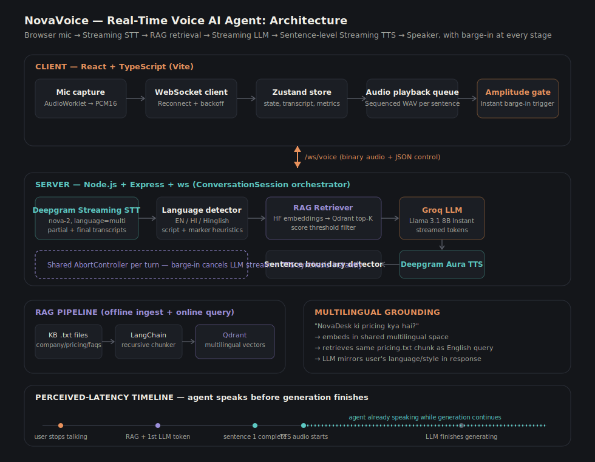

# NovaVoice — Real-Time Voice AI Agent

A production-grade, real-time, multilingual Voice AI Agent. Speak to it in English, Hindi, or Hinglish — it transcribes you live, retrieves grounded facts from a knowledge base, streams an LLM response token-by-token, and starts speaking the first sentence before the rest of the answer has even finished generating. Interrupt it mid-sentence and it stops instantly and listens.

Built for a fictional company, **NovaDesk** (a customer support SaaS), as the grounding domain.



---

## Table of contents

- [Demo flow](#demo-flow)
- [Quick start](#quick-start)
- [Technology choices](#technology-choices)
- [Why Deepgram](#why-deepgram)
- [Why Groq](#why-groq)
- [Why RAG](#why-rag)
- [Latency optimizations](#latency-optimizations)
- [Multilingual support](#multilingual-support)
- [Barge-in support](#barge-in-support)
- [Folder structure](#folder-structure)
- [Environment variables](#environment-variables)
- [Production hardening already in place](#production-hardening-already-in-place)
- [Future improvements](#future-improvements)

---

## Demo flow

```
User: "What is NovaDesk pricing?"
Agent: "NovaDesk starts at ₹4,999 per month."

User: "NovaDesk ki pricing kya hai?"
Agent: "NovaDesk ki shuruaati pricing ₹4,999 per month hai."

User: "Do you support WhatsApp?"
Agent: "Yes, WhatsApp integration is available starting from the Growth plan."

User: "What's your refund policy on alien abduction insurance?"
Agent: "I don't have that information in my knowledge base."
```

The last example matters as much as the first three: the agent **never hallucinates**. If the knowledge base doesn't contain the answer, it says so, in the user's language, instead of guessing.

---

## Quick start

### Prerequisites
- Node.js ≥ 18.18
- A [Deepgram](https://deepgram.com) API key (STT + TTS)
- A [Groq](https://console.groq.com) API key (LLM)
- A [HuggingFace](https://huggingface.co/settings/tokens) API token (embeddings)
- A running [Qdrant](https://qdrant.tech) instance — easiest via Docker:
  ```bash
  docker run -p 6333:6333 qdrant/qdrant
  ```

### 1. Server setup

```bash
cd server
npm install --legacy-peer-deps   # langchain's optional sqlite peer conflicts with npm's strict resolver
cp .env.example .env
# edit .env and fill in DEEPGRAM_API_KEY, GROQ_API_KEY, HUGGINGFACE_API_KEY, QDRANT_URL

npm run ingest   # chunks knowledge-base/*.txt, embeds them, upserts into Qdrant
npm run dev      # starts the Express + WebSocket server on :8080
```

### 2. Client setup

```bash
cd client
npm install
cp .env.example .env   # defaults already point at localhost:8080, edit if needed
npm run dev             # starts Vite dev server on :5173
```

Open `http://localhost:5173`, click the orb, allow microphone access, and start talking.

### Verifying the RAG pipeline independently

You can sanity-check retrieval without speaking at all:

```bash
curl -X POST http://localhost:8080/api/rag/query \
  -H "Content-Type: application/json" \
  -d '{"query": "What is NovaDesk pricing?"}'
```

---

## Technology choices

| Layer | Choice | Why (short) |
|---|---|---|
| Frontend | React + TypeScript + Vite | Fast HMR, native ESM, first-class TS support |
| State | Zustand | Minimal boilerplate, selector-based subscriptions avoid re-rendering the whole tree on every streamed token |
| Backend | Node.js + Express | Same runtime as the WebSocket layer; trivial to share types and keep the whole pipeline in one process for low hop-count latency |
| Transport | Raw `ws` WebSocket (binary + JSON multiplexed) | Audio frames need a persistent, low-overhead, full-duplex channel; HTTP polling or SSE can't do bidirectional binary streaming |
| STT | Deepgram streaming (Nova-2, `language=multi`) | See [Why Deepgram](#why-deepgram) |
| LLM | Groq — Llama 3.1 8B Instant | See [Why Groq](#why-groq) |
| Embeddings | HuggingFace `paraphrase-multilingual-MiniLM-L12-v2` | One shared vector space across English, Hindi, and Hinglish queries, so a Hinglish question retrieves the same chunk an English question would |
| Vector DB | Qdrant | Fast, simple REST/gRPC API, runs locally in one Docker command or hosted on Qdrant Cloud, native score-threshold filtering |
| Chunking/orchestration | LangChain (`RecursiveCharacterTextSplitter`) | Battle-tested recursive splitting that respects paragraph/sentence boundaries before falling back to hard splits |
| TTS | Deepgram Aura (streaming) | Same vendor/API surface as STT, low time-to-first-byte streaming synthesis |

---

## Why Deepgram

Deepgram was chosen for **both** STT and TTS for three concrete reasons:

1. **True streaming, not chunked polling.** Deepgram's `listen.live` WebSocket API returns interim ("partial") results within ~100-300ms of speech starting, and Aura's TTS streams audio bytes back before the full sentence's audio is synthesized. Both are essential for a "speak before you finish thinking" pipeline.
2. **Built-in multilingual code-switch detection.** Setting `language=multi` on the STT connection lets Deepgram detect English and Hindi speech (including switching mid-utterance) without the client having to pre-select a language or run separate models per language.
3. **One vendor, one API shape, one auth story for both ends of the audio pipeline.** Fewer moving parts at the audio boundary (which is the most latency- and reliability-sensitive part of the whole system) means fewer places for things to silently disagree about sample rate, encoding, or session lifecycle.

---

## Why Groq

Groq runs Llama 3.1 8B Instant on custom LPU hardware rather than GPUs, which matters here for one specific reason: **first-token latency**. In a pipeline where the agent should start speaking sentence one while sentence three is still being generated, the time between "RAG context is ready" and "first token arrives" is pure dead air to the user. Groq's inference is typically well under 200-300ms to first token with very high tokens/sec throughput thereafter — fast enough that, combined with sentence-level TTS streaming, the agent can feel like it's speaking "live" rather than "after thinking."

Llama 3.1 8B (vs. a larger model) was chosen deliberately: this is a grounded, retrieval-constrained support agent answering from a handful of retrieved chunks, not a general reasoning agent — an 8B model following an explicit "only use the provided context" instruction is plenty, and the latency savings compound directly into perceived responsiveness.

---

## Why RAG

Three reasons, in order of importance for this use case:

1. **Anti-hallucination by construction, not by prompting alone.** A support agent that invents a wrong price or a nonexistent feature is worse than one that says "I don't know." RAG lets us make "I don't have that information" the literal fallback path: if retrieval returns nothing above the similarity threshold, we never even call the LLM — we return the canned not-found response directly (see `retriever.ts` + `conversationSession.ts`). This is a structural guarantee, not just a system-prompt request.
2. **Updatable knowledge without retraining.** Pricing changes, FAQs get added — `npm run ingest` re-embeds and re-upserts in seconds. No fine-tuning, no redeploying the LLM.
3. **Small, cheap, fast context.** We never inject the entire knowledge base into the prompt — only the top-K chunks above a relevance threshold. This keeps the prompt short (fast time-to-first-token from Groq) and keeps the model's attention on exactly the facts relevant to this one question.

---

## Latency optimizations

Every one of these exists specifically to shrink the gap between "user stops talking" and "user hears the agent's voice":

- **Sentence-level TTS streaming, not response-level.** `SentenceDetector` (server/src/utils/sentenceDetector.ts) buffers LLM tokens and emits a sentence the instant it sees terminal punctuation (handling English `. ! ?` and Hindi `। ॥`, while guarding against false positives like "Mr." or "₹4,999.50"). The first sentence goes to TTS while the LLM is still generating the second and third — the agent is speaking *during* generation, not *after* it.
- **Concurrent per-sentence TTS synthesis with ordered playback.** Sentence 2's audio starts synthesizing the moment sentence 2 is detected, in parallel with sentence 1 still playing. The client's `AudioPlaybackQueue` buffers by sentence index and always plays them in order, so concurrency never causes audio to arrive out of sequence.
- **Retrieval-gated LLM calls.** If RAG finds nothing relevant, we skip the LLM call entirely and return the not-found message immediately — saving an entire network round-trip and generation cycle for queries the KB can't answer anyway.
- **Short, constrained prompts.** Only the top-K (default 4) retrieved chunks go into the system prompt — never the full KB — keeping the prompt small so Groq's first-token latency stays low.
- **`endpointing`/`utterance_end_ms` tuning on Deepgram STT.** These control how long Deepgram waits in silence before finalizing an utterance — tuned low enough to feel responsive without cutting off natural pauses mid-sentence.
- **Dual-layer barge-in detection.** A lightweight client-side RMS amplitude gate (`utils/amplitudeGate.ts`) stops local audio playback the instant it detects speech-like energy in the mic — before any network round-trip — while the server independently confirms via Deepgram and aborts the LLM/TTS pipeline with a shared `AbortController`. The user-perceived interrupt latency is bounded by local audio processing, not network RTT.
- **One process, in-memory turn state.** No database round-trip for conversation history within a session; the last few turns are held in memory on the `ConversationSession` for prompt context.
- **Live latency telemetry.** Every turn reports STT/RAG/LLM-first-token/TTS-first-audio/total timings back to the client (`metrics` WS message) so regressions are visible immediately during development, not just inferred from vibes.

---

## Multilingual support

- **Detection** combines Deepgram's per-utterance language hint with a script + function-word heuristic (`server/src/services/language/detectLanguage.ts`) to distinguish English, Hindi (Devanagari), and Hinglish (code-mixed, usually romanized) — Deepgram alone has no "Hinglish" category, so this layer is what actually produces the three-way classification the UI displays.
- **Grounding stays language-agnostic.** Embeddings use a multilingual sentence-transformer model, so a Hinglish query and its English equivalent land close together in vector space and retrieve the same knowledge base chunks.
- **Response language mirrors the user's**, enforced directly in the LLM system prompt (`server/src/services/llm/prompt.ts`): English in, English out; Hindi script in, Hindi script out; Hinglish in, natural Hinglish out — with numbers, prices, and the product name kept verbatim regardless of language.
- **The "not found" fallback is localized too** (`NOT_FOUND_RESPONSES`), so an ungrounded Hindi question gets a Hindi refusal, not an English one.

---

## Barge-in support

When the user starts speaking while the agent is mid-response:

1. The client's amplitude gate fires immediately, calling `ttsService.interrupt()` (stops the `AudioBufferSourceNode` synchronously) and sending a `barge_in` message to the server.
2. Any audio frame arriving at the server while `state === "speaking"` is also treated as an implicit barge-in signal server-side, independent of the client message — so a slow/dropped `barge_in` message doesn't leave the pipeline stuck.
3. The session's shared `AbortController` for that turn is aborted, which:
   - Stops the Groq stream consumption loop (`for await` checks `signal.aborted` every iteration).
   - Cancels any in-flight TTS synthesis calls.
   - Causes all "is this turn stale?" checks (`isStale()`) throughout `ConversationSession` to short-circuit pending work instead of sending it to the client.
4. State transitions back to `listening`, Deepgram STT keeps streaming (it was never stopped), and the next final transcript starts a brand-new turn with a fresh `AbortController`.

> [!NOTE]
> **Echo Cancellation & Microphone Leakage**: Although browser-level Echo Cancellation (`echoCancellation: true`) is enabled on the client microphone stream, setups without headphones (using speakers) can experience audio leakage at higher volumes. The agent's synthesized voice can feed back into the microphone, exceed the threshold of the client-side `AmplitudeGate` (default `0.02` RMS), and trigger an accidental barge-in. Wearing headphones is recommended for the best experience.

---

## Folder structure

```
client/
  src/
    components/       # ConversationView, ControlPanel (state orb), LatencyPanel,
                       # TranscriptBubble, StatusIndicator, RagPanel, ErrorBoundary
    hooks/            # useVoiceAgent (orchestration), useLatencyMetrics,
                       # useConversationHistory (selector hooks)
    services/
      stt/            # STT contract types (actual STT connection lives server-side)
      tts/            # ttsPlaybackService — wraps the Web Audio playback queue
      llm/            # (reserved — LLM runs server-side; types/contracts only)
      rag/            # RAG display facade (retrieval runs server-side)
      transport/      # VoiceWebSocketClient — reconnecting WS client
      audio/          # micCapture (AudioWorklet), audioPlaybackQueue
    store/            # Zustand conversationStore
    types/            # WebSocket protocol + domain types
    utils/            # amplitudeGate, id generator
    pages/            # HomePage
  public/
    worklets/         # pcm16-worklet.js (static AudioWorklet, see note below)

server/
  src/
    routes/           # health.ts, ragDebug.ts
    services/
      stt/            # deepgramStt.ts — streaming STT session + reconnect
      tts/            # deepgramTts.ts, voiceMap.ts
      llm/            # groqClient.ts, prompt.ts (grounding + language rules)
      rag/            # embeddings.ts, qdrantClient.ts, chunker.ts, retriever.ts, ingest.ts
      language/       # detectLanguage.ts
    ws/               # conversationSession.ts (the pipeline orchestrator), wsServer.ts
    types/            # shared protocol types
    utils/            # env, logger, retry, sentenceDetector
  knowledge-base/      # company_info.txt, pricing.txt, faqs.txt

docs/
  architecture-diagram.svg
```

> **Note on the AudioWorklet file:** `client/src/services/audio/pcm16Worklet.ts` is a fully-typed reference copy kept for readability. The file actually loaded at runtime is `client/public/worklets/pcm16-worklet.js` (plain JS), because AudioWorklet modules are fetched as standalone scripts via `audioContext.audioWorklet.addModule(url)` and can't be bundled inline like a normal ES import — Vite has to serve it as an untouched static asset. Keep both in sync if you change the resampling logic.

---

## Environment variables

See `server/.env.example` and `client/.env.example` for the full list with inline documentation. Key ones:

| Variable | Where | Purpose |
|---|---|---|
| `DEEPGRAM_API_KEY` | server | STT + TTS auth |
| `GROQ_API_KEY` | server | LLM auth |
| `HUGGINGFACE_API_KEY` | server | Embeddings auth |
| `QDRANT_URL` | server | Vector DB endpoint |
| `RAG_TOP_K`, `RAG_SCORE_THRESHOLD` | server | Retrieval tuning — raise the threshold to make the agent more conservative about what counts as "grounded" |
| `VITE_WS_URL` | client | Backend WebSocket endpoint |

---

## Production hardening already in place

- **TypeScript everywhere**, strict mode, on both client and server.
- **Service abstraction**: every external dependency (STT, TTS, LLM, vector DB, embeddings) sits behind a narrow module boundary (`services/*`) so any one of them can be swapped without touching the orchestrator.
- **Error boundaries**: top-level React `ErrorBoundary` with a recoverable retry UI.
- **AbortController-based cancellation** end-to-end: barge-in, component unmount, and stale-turn detection all flow through the same cancellation primitive rather than ad-hoc boolean flags.
- **Retry logic**: `withRetry()` (server/src/utils/retry.ts) wraps idempotent network calls (embeddings, Qdrant search/upsert) with exponential backoff + jitter; streaming connections use their own reconnect logic instead, since "retry the whole call" isn't meaningful for a live socket.
- **WebSocket reconnect**: both the client (`VoiceWebSocketClient`) and the server's Deepgram STT session (`DeepgramSTTSession`) reconnect with capped exponential backoff on unexpected drops, buffering a small amount of in-flight audio so a brief network blip doesn't lose the user's speech.
- **Validated environment config**: `server/src/utils/env.ts` uses Zod to fail fast at boot with a clear message if any required env var is missing, instead of failing confusingly deep inside a request.
- **Mobile-responsive UI**: the layout collapses from a two-column console+feed grid to a stacked single column under 860px, with a smaller state orb.

---

## Future improvements

- **Server-side VAD-based endpointing tuning per accent/language** — Hindi and Hinglish speech patterns have different natural pause lengths than English; a single global `endpointing` value is a reasonable default but not optimal for every speaker.
- **Conversation persistence** — currently in-memory per WebSocket session; a production deployment would persist transcripts/turns to a database for analytics, QA review, and multi-device session resume.
- **Streaming TTS WebSocket instead of per-sentence REST calls** — Deepgram also offers a persistent TTS WebSocket; moving to it would shave a few more milliseconds of connection overhead per sentence at the cost of more complex stream multiplexing.
- **Confidence-aware RAG threshold** — currently a single static `RAG_SCORE_THRESHOLD`; an adaptive threshold (e.g., relative to the score distribution of the current query's results) could reduce both false "not found" answers and marginal hallucination risk.
- **Multi-turn RAG query rewriting** — e.g. "what about the Enterprise one?" after a pricing question currently relies on chat history in the LLM prompt rather than rewriting the retrieval query itself; a query-rewriting step would improve retrieval recall on pronoun-heavy follow-ups.
- **Horizontal scaling of the WebSocket layer** — the current single-process design is appropriate for this assignment's scope; a real production deployment would need sticky sessions or a shared session store behind a load balancer.
- **Automated test suite** — unit tests for `SentenceDetector` and `detectLanguage` (both pure functions, easy to test exhaustively) and integration tests for the RAG retrieval threshold behavior would be the first additions.
- **Voice selection per detected language** — `voiceMap.ts` is already structured to support this; it's currently a placeholder pointing every language at the same Aura voice pending availability of dedicated Hindi-tuned TTS voices.
